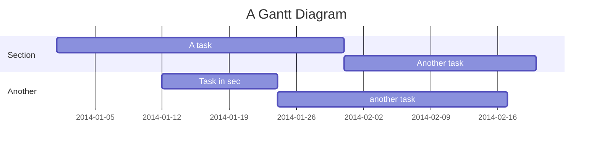

# DocsifyTest

This is a test markdown file for working with docsify-this.

It's got some inline equation stuff: $A=\frac{B}{j\pi}$ And it might soon have a mermaid chart.

## Oh, look!

It has got a mermaid chart...

Wasn't that fun?
